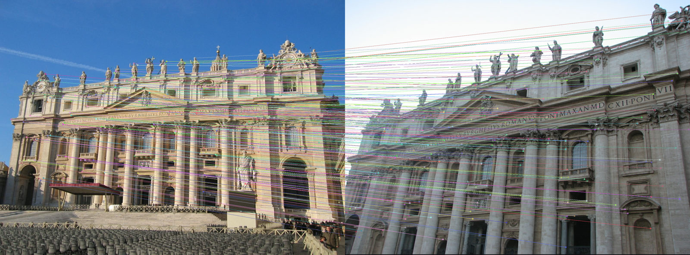
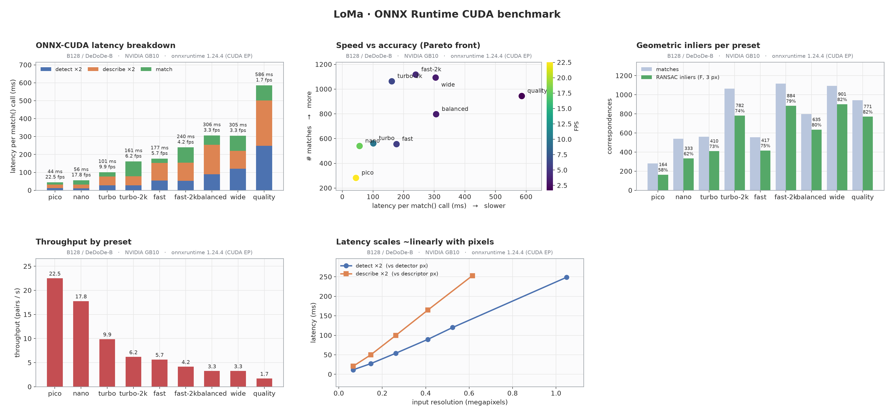
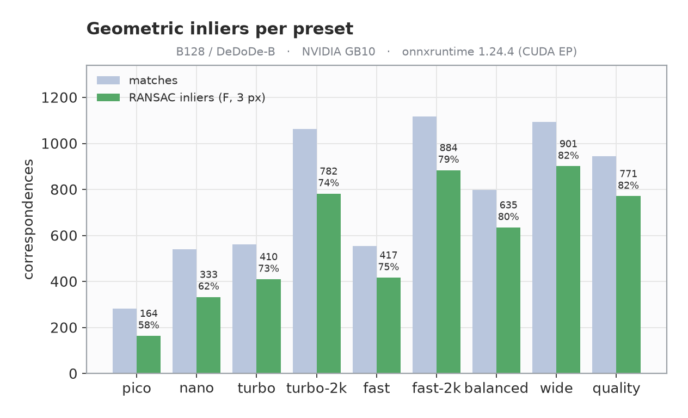
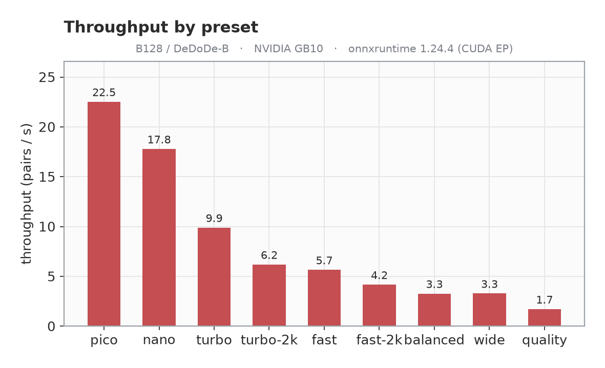
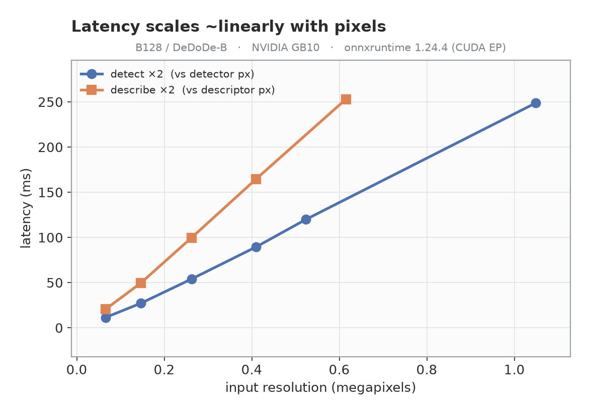
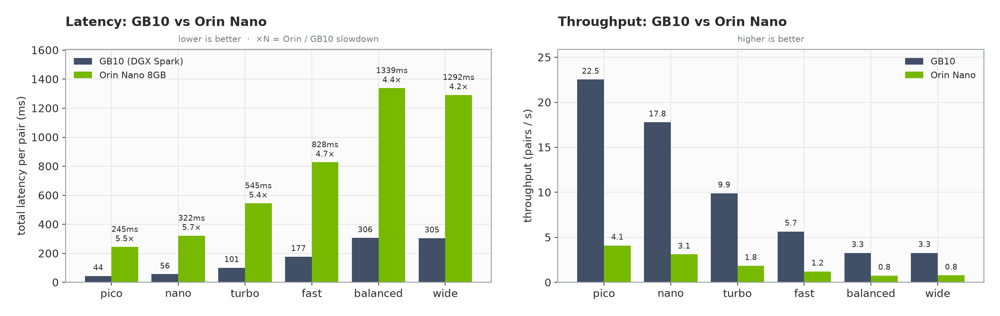
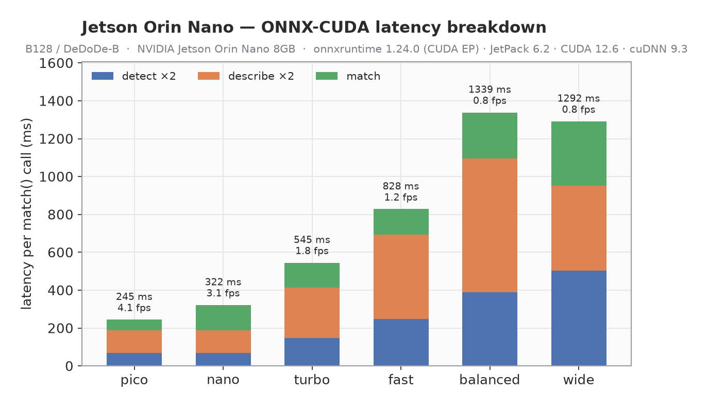

# LoMa · ONNX export + C++ / Jetson / DGX-Spark deployment

Export every [LoMa](https://github.com/davnords/LoMa) model to **ONNX**, run it on **GPU
via ONNX Runtime (CUDA EP)**, and deploy it from a small **reusable C++ library** — with
resolution/keypoint **presets** tuned for the Jetson Orin Nano 8 GB and a full
**benchmark + validation** suite. The original PyTorch code is untouched; everything here
lives self-contained in this `deployment/` folder.

<p align="center"></p>
<p align="center"><sub>LoMa B128 via ONNX Runtime — 1117 correspondences on a wide-baseline pair (220 drawn)</sub></p>

<p align="center"></p>

## Highlights
- **All 5 variants exported** (B, B128, R, L, G) + a shared detector and per-arch
  descriptors — each a single self-contained `.onnx`.
- **ONNX == PyTorch**: matchers agree **100%** (99.95% for B128), descriptors **cosine 1.0**,
  end-to-end **99.5% of matches within 1 px**.
- **Runs on GPU via ONNX Runtime CUDA EP** — including a from-source `onnxruntime-gpu`
  build for the **DGX Spark GB10** (sm_121, CUDA 13), where no prebuilt wheel exists.
- **C++ library** (`cpp/`) with a 3-line API, CUDA→CPU fallback, and `find_package(LoMa)`.
- **Presets** from `pico` (256², **22 FPS**) → `nano` → `turbo` → `fast` → `quality` (1024²),
  plus landscape `wide` (512×1024) — trade latency for matches.

---

## Model zoo (`onnx/`)
Each LoMa model is a 3-stage pipeline; stages are exported separately so the heavy
detector/descriptor are **shared** instead of duplicated per variant.

| stage | file | size | notes |
|-------|------|------|-------|
| **detector** (DaD) | `loma_detector_<preset>.onnx` | ~26 MB | shared by all variants; resolution + keypoints baked in |
| **descriptor** DeDoDe-B | `loma_descriptor_dedode_b_<preset>.onnx` | 54 MB | 128-d, light — **use this on 8 GB** |
| **descriptor** DeDoDe-G | `loma_descriptor_dedode_g.onnx` | 1.3 GB | 256-d, + DINOv2 ViT-L |
| **matcher** | `loma_matcher_{B128,B,R,L,G}.onnx` | 47 / 47 / 47 / 183 / 725 MB | per variant, dynamic shapes |

| variant | descriptor | desc dim | matcher | good for |
|---------|-----------|----------|---------|----------|
| **B128** | DeDoDe-B | 128 | 47 MB | **Orin Nano / real-time** |
| B | DeDoDe-G | 256 | 47 MB | accuracy, has GPU/VRAM |
| R | DeDoDe-G | 256 | 47 MB | rotation-invariant (aerial) |
| L | DeDoDe-G | 256 | 183 MB | higher accuracy |
| G | DeDoDe-G | 256 | 725 MB | best accuracy |

> Some files exceed GitHub's 100 MB limit (`loma_matcher_G`, `loma_matcher_L`,
> `loma_descriptor_dedode_g`). Ship them via **GitHub Releases** or **Git LFS** —
> they're git-ignored by default. Regenerate any model with `export_onnx.py` /
> `export_jetson.py`.

---

## Benchmark (NVIDIA GB10, onnxruntime 1.24.4 CUDA EP, B128/DeDoDe-B)
`total` is the cost of one `match()` (detect ×2 + describe ×2 + match). `fidelity` =
fraction of ONNX matches within 2 px of PyTorch.

| preset | detector | kpts | total | FPS | matches | inliers (F,3px) | fidelity |
|--------|----------|------|-------|-----|---------|-----------------|----------|
| **pico** | 256² | 512 | **44 ms** | **22.5** | 282 | 164 (58%) | 99.3% |
| **nano** | 256² | 1024 | **57 ms** | **17.4** | 540 | 333 (62%) | 99.3% |
| turbo | 384² | 1024 | 102 ms | 9.8 | 561 | 410 (73%) | 99.5% |
| **turbo-2k** | 384² | 2048 | 162 ms | 6.2 | 1063 | 782 (74%) | 99.5% |
| fast | 512² | 1024 | 178 ms | 5.6 | 555 | 417 (75%) | 99.5% |
| fast-2k | 512² | 2048 | 236 ms | 4.2 | **1117** | 884 (79%) | 99.5% |
| balanced | 640² | 1536 | 304 ms | 3.3 | 797 | 635 (80%) | 99.3% |
| **wide** | 512×1024 | 2048 | 304 ms | 3.3 | 1093 | **901 (82%)** | 99.5% |
| quality | 1024² | 2048 | 589 ms | 1.7 | 944 | 771 (82%) | 99.4% |

<p align="center"></p>
<p align="center"></p>

> **Insights** (B128):
> - **More keypoints beats more resolution.** `turbo-2k` (384² + 2048 kpts) → **782 inliers**
>   at 162 ms, beating `quality` (1024²) **771 inliers** at 589 ms on *both* axes.
> - **Low resolution stays useful** — `nano` (256²) still yields **333 RANSAC inliers** at
>   **17.4 FPS** (3× faster than `fast`). Great Jetson real-time default.
> - **Resolution buys precision, not count.** Inlier *ratio* climbs 58% → 82% from `pico`
>   to `wide`; pick higher-res presets when geometric precision matters.
> - `pico` for max throughput (22.5 FPS); `wide`/`fast-2k` for the most verified inliers.
>
> RANSAC inliers = fundamental matrix (USAC_MAGSAC, 3 px). GB10 ≫ Orin Nano — run
> `cpp/loma_bench` on-device for target numbers (the *relative* ordering holds).

---

## On-device: Jetson Orin Nano 8 GB (measured)
Real numbers from a Jetson Orin Nano 8 GB (JetPack 6.2, CUDA 12.6, cuDNN 9.3) running
the B128 pipeline through **onnxruntime 1.24 CUDA EP**.

<p align="center"></p>

| preset | det / kpts | detect | describe | match | **total** | **FPS** | #matches |
|--------|-----------|--------|----------|-------|-------|-----|----------|
| **pico** | 256² / 512 | 67 | 120 | 57 | **245 ms** | **4.1** | 282 |
| **nano** | 256² / 1024 | 68 | 121 | 133 | **322 ms** | **3.1** | 539 |
| turbo | 384² / 1024 | 147 | 266 | 133 | 545 ms | 1.8 | 562 |
| fast | 512² / 1024 | 248 | 447 | 133 | 828 ms | 1.2 | 555 |
| balanced | 640² / 1536 | 389 | 705 | 244 | 1339 ms | 0.75 | 798 |
| wide | 512×1024 / 2048 | 504 | 447 | 341 | 1292 ms | 0.77 | 1093 |
| quality | 1024² / 2048 | — | — | — | **OOM (>8 GB)** | — | — |

<p align="center"></p>

> - **GPU confirmed on the Orin's iGPU** (`provider = CUDAExecutionProvider`).
> - **Cross-platform correctness:** Orin match counts are **identical to the GB10**
>   (nano 539, fast 555, balanced 798, wide 1093) — same ONNX, same outputs.
> - **Use `pico` (4.1 FPS) / `nano` (3.1 FPS)** for near-real-time on the Orin Nano.
> - `quality` (1024²) **OOMs** the 8 GB device under the CUDA EP — cap at `wide`; run one
>   preset per process to avoid accumulating CUDA contexts. TensorRT FP16 (needs
>   `libnvinfer`) would lower both latency and memory.
> - Orin Nano is **~4–6× slower** than the GB10 across presets.

### Setting up onnxruntime-gpu on a bare Jetson (the gotcha)
The PyPI `nvidia-*-cu12` CUDA wheels are **sbsa/dGPU** builds and **fail on Tegra**
(`CUBLAS_STATUS_ALLOC_FAILED`). Install **JetPack's Tegra-native** CUDA instead:
```bash
# onnxruntime-gpu wheel (Jetson):  https://pypi.jetson-ai-lab.io/jp6/cu126
sudo apt-get install -y cuda-cudart-12-6 libcublas-12-6 libcufft-12-6 libcudnn9-cuda-12
export LD_LIBRARY_PATH=/usr/local/cuda-12.6/targets/aarch64-linux/lib:/usr/lib/aarch64-linux-gnu
python3 jetson_bench.py --presets pico nano turbo fast --iters 15   # CUDA EP
```
`jetson_bench.py` is a dependency-light (numpy + PIL + onnxruntime) on-device runner.

---

## Quickstart — Python (ONNX Runtime)
```bash
# from the LoMa repo root: set up the `loma` package + ONNX deps
uv sync
uv pip install onnx onnxruntime onnxscript  # CPU EP; for GPU see "ONNX Runtime on GPU"

cd deployment                            # the tools live here and run from here (self-contained)
uv run export_onnx.py   --variants B128            # detector + descriptor + matcher
uv run export_jetson.py --presets fast wide --archs dedode_b   # optimized presets
uv run compare_onnx.py                             # ONNX-vs-PyTorch end-to-end check
uv run bench_sweep.py                              # benchmark + charts (needs CUDA EP)
```

### GTX 1070 / ONNX Runtime 1.17.1

The `landscape_4x3_512` preset provides a lightweight 4:3 pipeline with a
384×512 detector, 384×384 DeDoDe-B descriptor, and 512 keypoints. Export on CPU
because current PyTorch CUDA wheels no longer compile kernels for Pascal
(`sm_61`), then finalize the graphs for ONNX Runtime 1.17.1:

```bash
cd deployment
LOMA_EXPORT_CPU=1 uv run export_jetson.py \
  --presets landscape_4x3_512 --archs dedode_b \
  --components detector descriptor --outdir onnx
LOMA_EXPORT_CPU=1 uv run export_onnx.py \
  --variants B128 --components matcher --num-keypoints 512 --outdir onnx
uv run finalize_ort117.py --in-place \
  onnx/loma_detector_landscape_4x3_512.onnx \
  onnx/loma_descriptor_dedode_b_landscape_4x3_512.onnx \
  onnx/loma_matcher_B128.onnx
```

Use a separate Python 3.11 runtime for Pascal inference. These versions are the
tested x86_64 combination:

```bash
uv venv --python 3.11 .venv-ort117
source .venv-ort117/bin/activate
uv pip install "numpy<2" "onnxruntime-gpu==1.17.1" \
  "nvidia-cuda-runtime-cu11==11.8.89" \
  "nvidia-cublas-cu11==11.11.3.6" \
  "nvidia-cudnn-cu11==8.9.6.50"
CUDA_LIBS=$(python -c 'import pathlib, site; print(":".join(str(p) for r in site.getsitepackages() for p in pathlib.Path(r, "nvidia").glob("*/lib")))')
LD_LIBRARY_PATH="$CUDA_LIBS:${LD_LIBRARY_PATH:-}" \
  python benchmark_onnx_gpu.py --help
```

`finalize_ort117.py` checks the source graph, extracts only nodes and initializers
needed by its declared inputs and outputs, checks the result again, and caps the IR
header at version 9. The opset remains 18. On the B128 matcher this removes detector
and descriptor weights retained by the unoptimized PyTorch 2.8 export.

## Quickstart — C++ (3 lines)
```cpp
loma::Options o;
o.detector_path="onnx/loma_detector_fast.onnx";
o.descriptor_path="onnx/loma_descriptor_dedode_b_fast.onnx";
o.matcher_path="onnx/loma_matcher_B128.onnx";
o.detector_size=512; o.descriptor_size=512; o.num_keypoints=1024; o.descriptor_dim=128;

loma::LoMa model(o);                       // CUDA EP → CPU fallback
auto matches = model.match(imgA, imgB);    // std::vector<loma::Match>{a,b,score}
```
Build + integrate: see **[cpp/README.md](cpp/README.md)**.

### COLMAP / SfM
LoMa is the *matcher*, so it slots into COLMAP via the custom keypoints + imported
matches path (no SIFT/NN step). [`cpp/examples/colmap_import.cpp`](cpp/examples/colmap_import.cpp)
extracts keypoints and matches every image pair, then writes cameras, images,
keypoints and raw matches straight into a COLMAP SQLite database (built when
`libsqlite3-dev` is present):
```bash
./loma_colmap_import onnx scene.db img1.jpg img2.jpg img3.jpg --preset fast
colmap matches_importer --database_path scene.db \
       --match_list_path scene.db.matches.txt --match_type raw   # geometric verification
colmap mapper --database_path scene.db --image_path imgs --output_path sparse
```

---

## ONNX Runtime on GPU (aarch64 / Blackwell)
`pip install onnxruntime-gpu` has **no aarch64 + CUDA wheel**. Options:

- **Jetson Orin**: use JetPack's `onnxruntime-gpu` (CUDA EP ready) — point CMake at `/usr`.
- **DGX Spark / GB10 (sm_121, CUDA 13)**: build from source (no prebuilt wheel exists):
  ```bash
  ./build_ort_gpu.sh     # clones ORT v1.24.4, builds with CMAKE_CUDA_ARCHITECTURES=121,
                         # installs the cp3x wheel, verifies CUDAExecutionProvider
  ```
  or grab prebuilt C++ libs from
  [Albatross1382/onnxruntime-aarch64-cuda-blackwell](https://github.com/Albatross1382/onnxruntime-aarch64-cuda-blackwell).
  **Use FP32 models** — sm_121 has no INT8 kernels (our exports are FP32 ✓).
- **Python on aarch64 GPU**: only via a from-source wheel; otherwise the Python GPU
  runtime is PyTorch CUDA (the ONNX models reproduce it bit-for-bit).

---

## Validation — ONNX reproduces PyTorch
| stage | metric | result |
|-------|--------|--------|
| detector | keypoint-set agreement / probs max-diff | 99.4–99.85% / ~5e-8 |
| descriptor (B) | cosine similarity (mean / min) | 1.00000 / 1.0000 |
| matcher | match-index agreement | **100%** (B/R/L/G), 99.95% (B128) |
| **end-to-end** (B128) | matches & ≤1 px overlap | 984 vs 984, **99.5%** |

The small residual is `topk` tie-reordering + fp32 GPU↔CPU rounding, not a graph error.

---

## Contents of this `deployment/` folder
```
export_onnx.py       export detector/descriptor/matcher to ONNX (+ validate)
export_jetson.py     resolution/keypoint presets (fast/balanced/quality/wide)
compare_onnx.py      end-to-end ONNX-vs-PyTorch comparison
bench_sweep.py       GPU benchmark sweep + charts  → docs/
benchmark_gpu.py     PyTorch-CUDA latency reference
viz_matches.py       qualitative match figure (docs/matches.png)
jetson_bench.py      on-device ONNX benchmark for Jetson (numpy + PIL only)
jetson_charts.py     Jetson charts + GB10-vs-Orin comparison  → docs/
build_ort_gpu.sh     build onnxruntime-gpu for DGX Spark GB10 (sm_121)
cpp/                 reusable C++ library (ORT + OpenCV), CMake, examples
onnx/                exported models           docs/  charts + benchmark.json
```

> **Note:** several model files exceed GitHub's 100 MB limit (`loma_matcher_G`,
> `loma_matcher_L`, `loma_descriptor_dedode_g`) and are git-ignored — they're attached to
> the GitHub Release, or regenerate any model with `export_onnx.py` / `export_jetson.py`.

## Implementation notes
- Uses the **dynamo (torch.export) ONNX exporter** — the legacy TorchScript exporter
  emits ORT-invalid graphs here (bad `Concat` axis, `MaxPool` dilations).
- DINOv2's `@torch.compiler.disable` + internal `inference_mode` are stripped for export.
- The detector's torchvision `Normalize` (data-dependent branch) is swapped for plain
  arithmetic so `torch.export` can trace it; detector exports static (dynamic batch hits
  `if B == 0`).
- Weights are consolidated into single self-contained `.onnx` files.

## Contributor
This deployment layer — ONNX export of the full model family, the reusable C++ inference
library, the from-source `onnxruntime-gpu` build for the DGX Spark (GB10 / sm_121, where no
prebuilt wheel exists), real on-device Jetson Orin Nano enablement (incl. the Tegra CUDA
setup), and the benchmark + validation suite — was contributed by
**Ali Jabbari** ([@aliejabbari](https://github.com/aliejabbari)).

## Acknowledgements
All credit for the matching models goes to the **LoMa** authors — David Nordström,
Johan Edstedt, Georg Bökman, et al. (ECCV 2026) — and to the DeDoDe / DaD work by
[Parskatt](https://github.com/Parskatt). Cite their papers if you use the models:

```bibtex
@inproceedings{nordstrom2026loma,
  title     = {LoMa: Local Feature Matching Revisited},
  author    = {Nordstr\"om, David and Edstedt, Johan and B\"okman, Georg and others},
  booktitle = {Proceedings of the European Conference on Computer Vision (ECCV)},
  year      = {2026}
}
```

Upstream model code: <https://github.com/davnords/LoMa>.

## License
MIT for this deployment code. The exported matcher inherits LightGlue's Apache-2.0
license; the models inherit their respective upstream licenses.
